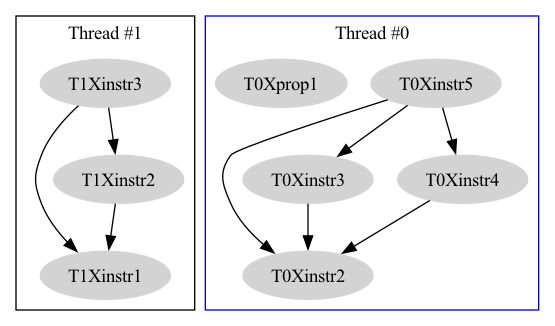

# ISA Weak Memory Interpreter
An interpreter for simple ISA with shared weak memory. 

## 🔨 Build and run
```sh
cargo build
./target/debug/isa_interpreter run -m ${MEMORY_MODEL} -p ${PROGRAMS}
```

## 📋 Parameters 
```sh
$ ./target/debug/isa_interpreter run --help
Run an interpreter on a given program

Usage: isa_interpreter run -m <MEMORY_MODEL> -p <PROGRAM_PATHS>

Options:
  -m <MEMORY_MODEL>       Which memory model to use: SC, TSO or PSO.
  -p <PROGRAM_PATHS>      List of paths to programs to run in different threads. Format: '<path1>, <path2>, ...'
  -h, --help              Print help
  -V, --version           Print version
```

## 📜 Usage
When you run a `run` command, the interpreter will run the given programs in different threads. The programs are run in the order they are given. The interpreter will ask for your choice of the next executed line at each step. 

Apart from choosing the next line you can use one of the following commands:
- `exit` Exit the interpreter.
- `memory` Print the current state of the memory.
- `registers` Print the current state of the registers.
- `graph <path>` Save the current execution graph to a file at the given path. The file will be saved in the `dot` format. You can use [Graphviz](https://graphviz.org/) to visualize the graph, or, if you have `dot` installed, you can use the `dot` command to convert the file to a different format. For example, to convert the file to a `png` image, you can run: 
```sh
dot -Tpng <dot-file-path> -o <png-file-path>
```
**Remark:** It's better to use absolute paths for the `graph` command.

## 📝 Supported functionality
- Implement a non-deterministic interpreter for the given ISA — it should choose one random execution on each run.
- Add support for PSO memory subsystem.
- Support tracing mode. 
- Support interactive mode.
- Generate execution graphs. 

## 📚 Examples

### Simple two threaded program
Let's consider a simple two threaded program with the following code in the first thread:
```txt 
r2 = 1488
store REL r2 #r1
load REL #r1 r3
r4 = 9
r3 = r3 + r4
store ACQ r3 #r5
```

And the following code in the second thread:
```txt
r1 = 1488
r2 = 28
store ACQ r1 #r5
store ACQ r2 #r6
```

Let's run the interpreter:
```sh
cargo build && ./target/debug/isa_interpreter run -m TSO -p 'etc/program_samples/program_1.txt, etc/program_samples/program_2.txt'
```

The interpreter will ask for your choice of the next executed line at each step. You can choose the next line by inputting the index of the line: 

```sh
0 | Thread 0, line 0: rr2 := 1488
1 | Thread 0, line 1: store REL rr2 mr1
2 | Thread 1, line 0: rr1 := 1488
3 | Thread 1, line 1: rr2 := 28
Please select an option and input the index:
graph /etc/graphs/graph_goto1.dot
```


```sh
0 | Thread 0, line 0: rr2 := 1488
1 | Thread 0, line 1: store REL rr2 mr1
2 | Thread 1, line 0: rr1 := 1488
3 | Thread 1, line 1: rr2 := 28
Please select an option and input the index: 
1
0 | Thread 0, line 0: rr2 := 1488
1 | Thread 0, line 2: mr1 := load REL rr3
2 | Thread 1, line 0: rr1 := 1488
3 | Thread 1, line 1: rr2 := 28
4 | Propagate for write (Thread 0, line 1: store REL rr2 mr1)
Please select an option and input the index: 
2
0 | Thread 0, line 0: rr2 := 1488
1 | Thread 0, line 2: mr1 := load REL rr3
2 | Thread 1, line 1: rr2 := 28
3 | Propagate for write (Thread 0, line 1: store REL rr2 mr1)
Please select an option and input the index: 
0
0 | Thread 0, line 2: mr1 := load REL rr3
1 | Thread 1, line 1: rr2 := 28
2 | Propagate for write (Thread 0, line 1: store REL rr2 mr1)
Please select an option and input the index: 
graph isa_interpreter/etc/graphs/graph2.dot
```



At the first step we have written a value of r1 register (it was uninitialized tho was 0) in the first thread to the shared memory. From that moment we had an option to propagate this value from the thread's buffer to the shared memory. Firstly, let's make sure it's not propagated yet: 

```sh
Please select an option and input the index: 
registers
Thread 1
r1: 1488

Thread 0
r2: 1488


0 | Thread 0, line 2: mr1 := load REL rr3
1 | Thread 1, line 1: rr2 := 28
2 | Propagate for write (Thread 0, line 1: store REL rr2 mr1)
Please select an option and input the index: 
memory

```

As could be seen, the memory is yet empty, writes to registers are present. Let's now propagate the write: 
```sh 
0 | Thread 0, line 2: mr1 := load REL rr3
1 | Thread 1, line 1: rr2 := 28
2 | Propagate for write (Thread 0, line 1: store REL rr2 mr1)
Please select an option and input the index:
2
0 | Thread 0, line 2: mr1 := load REL rr3
1 | Thread 1, line 1: rr2 := 28
Please select an option and input the index: 
memory
r1: 0
```

### Example of problem with goto under TSO
Let's consider a single thread program with the following code:
```txt 
L: r2 = 1488
r1 = 0 
if r1 goto L
```

To simulate a couple of steps of this program under TSO, we can run the following command:
```sh
cargo build && ./target/debug/isa_interpreter run -m TSO -p 'etc/program_samples/program_simple_label.txt'
```

From the beginning we have a reasonable graph as we do not have memory restrictions: 


```sh
0 | Thread 0, line 0: L: rr2 := 1488
1 | Thread 0, line 1: rr1 := 0
2 | Thread 0, line 2: if rr1 goto L
Please select an option and input the index: 
0
0 | Thread 0, line 1: rr1 := 0
1 | Thread 0, line 2: if rr1 goto L
Please select an option and input the index: 
0
0 | Thread 0, line 2: if rr1 goto L
Please select an option and input the index: 
graph isa_interpreter/etc/graphs/graph_goto2.dot
```


```sh 
0 | Thread 0, line 2: if rr1 goto L
Please select an option and input the index: 
0
0 | Thread 0, line 2: if rr1 goto L
1 | Thread 0, line 1: rr1 := 0
2 | Thread 0, line 0: L: rr2 := 1488
Please select an option and input the index: 
graph isa_interpreter/etc/graphs/graph_goto3.dot
```

And we come back to the initial state: 

